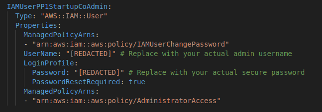
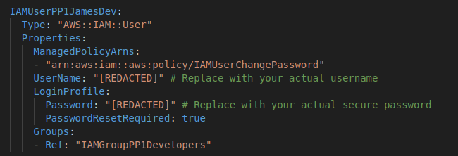

# IAM Permission Configuration

Note: This is fictional case study for educational and portfolio purposes

## Scenario

You are a Cloud Engineer Consultant, working with StartupCo, a fast-growing tech startup that recently launched their first product - a fitness tracking application.

They've been using AWS for three months, initially setting up their infrastructure quickly to meet launch deadlines.

Now that their product is live, they need to address their cloud security fundamentals.  The company has 10 employees (4 Developers, 2 Operation, 1 Finance Manager, 3 Data Analysts) who all currently share the AWS root account credentials to access and manage their cloud resources.

This negligence has exposed their company to serious security threats.

### **Key Issues Identified** 

* **Insecure AWS Root User Account**
  * No Multi-Factor-Authentication (MFA) enabled on the root user account
  * Every Employee of the company uses the root user account directly for daily use
  * Root User credentials not stored securely and shared via Teams chat
  * No password policy in place
* **No employee/job specific IAM permissions/policies in place**
  - Employees don't have their own IAM User accounts (They all use the root user account)
  - Every employee can access every resource currently used by the company unrestricted, which vastly increases the attack surface in case of a security breach. Principle of Least Privilege is also not followed here.
  - IAM User Groups are also not setup which makes assigning and revoking multiple permissions based on job role much more complicated.

### Proposed Solution ###

* **Secure the AWS Root User Account**
  * Enable MFA
  * Store the root account credentials securely using AWS Secrets Manager
  * Implement a strong and industry compliant password policy 

* **Provide every employee with fine-tuned permissions and access to resources according to job role**
  * Create individual IAM user accounts with MFA enabled for every employee
  * Create an IAM User account with Administrator privileges to prevent the use of the Root account for management purposes
  * Create the following IAM User Groups for individual job roles which only provide permissions and access to resources required for the job
     * Developers (need EC2 and S3 access)
     * Operations Team (need full infrastructure access)
     * Finance Team (needs cost management access such as AWS Budgests and Cost Explorer)
     * Data Analysts (needs read only access to data resources such as S3 and RDS)

## Solutions Implemented ##
The following section will showcase the step-by-step implementation of the proposed solution
### Secure the AWS Root User Account ###

* Enable MFA

  

* Store the root account credentials securely using AWS Secrets Manager
  
  

* Implement a strong and industry compliant password policy

  
  * This password policy is compliant with industry standard security frameworks like NIST, HIPAA, CIS etc

### Provide every employee with fine-tuned permissions and access to resources according to job role ###

The creation of IAM Users, User Groups and Permissions attachment was done using cloudformation, example code has been provided below. To view the full code containing permission configurations of all 10 employees, 4 User groups, attached permissions and the Admin user account, [Click here!](Cloudformation/PP1_IAM.yml)

 * Create an IAM User account with Administrator privileges to prevent the use of the Root account for management purposes

   

 * Create individual IAM user accounts with MFA enabled for every employee

   
   * Example code for IAM User Account creation of StartupCo Employee "James"

* Create IAM User Groups for individual job roles which only provide permissions and access to resources required for the job
   
   
   * Example code for creation of IAM User Group "Developers" and their attached permissions 

## Results

* AWS Root account has been secured with MFA and the credentials have been securely stored using AWS Secrets Manager. An Administrator user account has also been created preventing repeated use of the root account by everyone, which also reduces the attack surface in case of a breach.
*	Every employee has been given their own IAM user account with job relevant permissions to only those resources that are strictly required for their job role.
*	IAM User groups have been created to help assign/revoke multiple permissions at once from any user. This also enables the company to securely on-board new employees when the company decides to scale.
*	MFA for the Root User account as well as every IAM user account has been enabled, following best practices
*	Relevant password policy has been into place which are complaint with NIST, HIPAA, PCI DSS and CIS security frameworks
